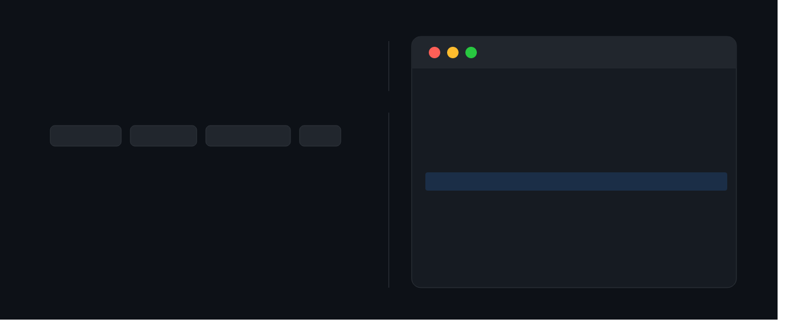

<p align="center">
  
</p>

<p align="center">
  <a href="https://www.npmjs.com/package/git-ai-commit"></a>
  
  
  
  
  
</p>

<p align="center">
  <b>AI-powered git commit messages — pick from 3 suggestions, generated locally or via API.<br/>Zero friction, zero cloud lock-in.</b>
</p>

---

```
$ git add src/auth.js
$ git-ai-commit

  git-ai-commit v2  ·  Ollama  ·  llama3
  ────────────────────────────────────────

  ✔ Got 3 suggestions

  Pick a commit message:  (↑↓ to move, Enter to confirm)

  › feat(auth): add JWT refresh token rotation with server-side invalidation
    fix(auth): prevent session expiry by rotating tokens on each request
    refactor(auth): extract token refresh logic into dedicated service
    ✏️  Write my own
    🔄 Regenerate
```

---

## Why?

Writing good commit messages is tedious. Bad commits pollute your history. Existing AI tools:
- Send your code to the cloud ☁️
- Lock you into one provider 🔒
- Give you one suggestion with no choice 🎲

`git-ai-commit` generates **3 suggestions in parallel**, runs **locally by default**, and supports OpenAI and Anthropic when you need more power.

---

## Features

| Feature | Details |
|---|---|
| 🔒 **Local-first** | Powered by Ollama — code never leaves your machine |
| ⚡ **3 suggestions** | Pick the best one, or regenerate |
| 🌐 **Multi-provider** | Ollama · OpenAI · Anthropic |
| 🎨 **3 commit styles** | Conventional · Simple · Detailed |
| 😄 **Emoji support** | Optional prefix |
| ⚙️ **Config file** | `~/.git-ai-commit.json` — set your defaults once |
| 🔁 **Git hook mode** | Auto-generate on every `git commit` |
| ✏️ **Always editable** | Write your own if none fit |

---

## Requirements

- [Node.js](https://nodejs.org) ≥ 18
- One of:
  - [Ollama](https://ollama.com) running locally *(free, private)*
  - `OPENAI_API_KEY` env var *(paid)*
  - `ANTHROPIC_API_KEY` env var *(paid)*

---

## Installation

```bash
npm install -g git-ai-commit
```

### Ollama (local, recommended)

```bash
ollama pull llama3   # or mistral, codellama, phi3...
ollama serve
```

### OpenAI

```bash
export OPENAI_API_KEY=sk-...
```

### Anthropic

```bash
export ANTHROPIC_API_KEY=sk-ant-...
```

---

## Usage

```bash
git add .
git-ai-commit
```

### Options

```
  Provider:
    -p, --provider <name>   ollama | openai | anthropic   (default: ollama)
    -m, --model <name>      Model override

  Generation:
    -s, --style <style>     conventional | simple | detailed  (default: conventional)
    -n, --count <n>         Number of suggestions            (default: 3)
    -e, --emoji             Add emoji prefix

  Behavior:
    -y, --yes               Auto-confirm first suggestion (great for hooks)
    -v, --verbose           Show diff preview
        --config            Show current config & path
```

### Examples

```bash
# Default: Ollama + llama3 + 3 suggestions
git-ai-commit

# OpenAI with detailed style
git-ai-commit --provider openai --style detailed

# Anthropic with emojis, auto-confirm
git-ai-commit --provider anthropic --emoji -y

# Local mistral, 5 suggestions
git-ai-commit -p ollama -m mistral -n 5
```

---

## Config file

Set your defaults once in `~/.git-ai-commit.json`:

```json
{
  "provider": "ollama",
  "model": "mistral",
  "style": "conventional",
  "emoji": true,
  "count": 3,
  "ollama": {
    "host": "http://localhost:11434"
  }
}
```

View your current config:

```bash
git-ai-commit --config
```

---

## Commit styles

| Style | Output |
|---|---|
| `conventional` | `feat(auth): add JWT refresh token rotation` |
| `simple` | `Add JWT refresh token rotation to prevent session expiry` |
| `detailed` | Subject line + blank line + bullet-point body |

---

## Git hook (auto-mode)

Install as a `prepare-commit-msg` hook — runs automatically on every `git commit`:

```bash
sh install-hook.sh
```

Uninstall:

```bash
rm .git/hooks/prepare-commit-msg
```

---

## Supported models

| Provider | Models |
|---|---|
| Ollama | `llama3`, `mistral`, `codellama`, `phi3`, `gemma`, [and more](https://ollama.com/library) |
| OpenAI | `gpt-4o-mini` *(default)*, `gpt-4o`, `gpt-3.5-turbo` |
| Anthropic | `claude-haiku-4-5-20251001` *(default)*, `claude-sonnet-4-6` |

---

## Contributing

PRs welcome! Roadmap:

- [ ] VS Code extension
- [ ] Multi-language commit messages (FR, ES, JP…)
- [ ] `git-ai-commit init` config wizard
- [ ] GitHub Actions integration

---

## License

MIT © [your name]
